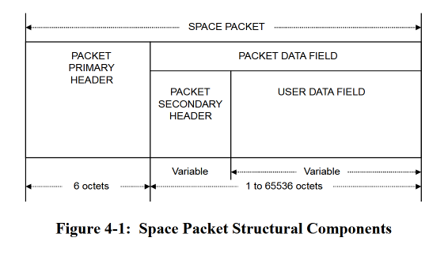
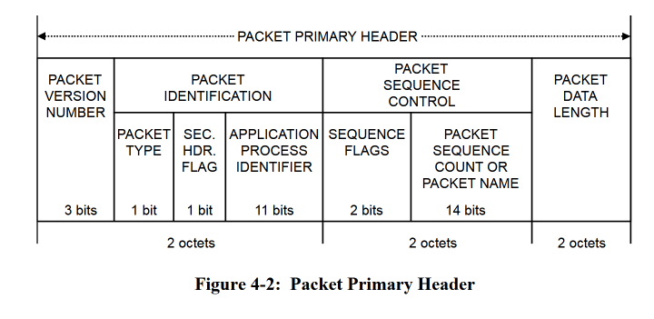

[TOC]

# ccsds_parser_comparison

Comparison of CCSDS packet parsing in Python, C++, and Rust. Compares speed of packet parsing for Space Packets as defined by [CCSDS 133.0-B-2](https://ccsds.org/publications/bluebooks/entry/3264/).

This was done with the following goals in mind:

1. Develop a skills relevant to space software engineering that I have not had much exposure to so far in my career:
   - Bitwise operations
   - Endianness
   - Packet parsing
1. Gain familiarity with compiled languages used commonly in industry (C++, Rust) and the supporting tooling for each
   - CMake
   - Rust's Cargo

# Research

- A CCSDS Space Packet must contain a Primary Header of 6 octets and a Packet Data Field of 1 to 2^16 octets.  
  
- An octet is defined as a sequence of 8 bits
- Octets in a Space Packet are transmitted MSB first. The MSB is the 0th bit in each octet.
- The Packet Primary Header consists of the following fields:  
  
  _ 3-bit packet version number is recommended to be '000'
  _ Packet Identification Field is a 13-bit field comprised of a 1-bit Packet Type, 1 bit Secondary Header Flag, and 11-bit APID
- The structure of the Packet Data Field is mandated only to have at least one of the following:
  - User-defined packet secondary header (variable length)
  - User data field
- If a Packet Secondary Header is used, it shall consist of either:
  - A Time Code Field only
  - An Ancillary Data Field only
  - A Time Code Field followed by an Ancillary Data Field

# Project Scope

## Packet Definition

- Packet version number is '000'
- A secondary header is used
- The secondary header is 133.0-B-2 compliant, containing a Time Code field and an Ancillary Data Field
  - Time code is defined by [CCSDS 301.0-B-4](https://ccsds.org/publications/bluebooks/entry/3147/)
    - No Preamble field
    - 4-byte coarse time, measuring seconds since CCSDS Unsegmented Time Code (CUC) epoch of 1 January 1958
    - 1-byte fine time, measuring subsections as 1/256ths of a second
  - For increased realism, the Ancillary Data Field itself contains the following structure:
  - 4-byte frame sync header, fixed at 0xABCD1234
  - 2-byte data length field
  - 2-byte CRC across the entire Space Packet, not including the CRC itself
  - Data field (variable length), max 65523 Bytes, to conform to the Space Packet's 2^16 Byte max Data Field (65536 - (5-byte time code, 4-byte frame sync header, 2-byte data length field, and 2-byte CRC))
- All packet fields are transmitted Big Endian, MSB first.

```json
[
    "primary_header": {
        "version_number": {
            "bits": 3,
            "expected": "0b000"
        },
        "packet_type": {
            "bits": 1
        },
        "sec_header_flag": {
            "bits": 1
        },
        "apid": {
            "bits": 11
        },
        "sequence_flags": {
            "bits": 2
        },
        "sequence_count": {
            "bits": 14
        },
        "data_length": {
            "bits": 32,
            "notes": "Length of data field, in bytes"
        }
    },
    "secondary_header": {
        "time_code_field": {
            "coarse_time": {
                "bits": 32,
                "notes": "Seconds since CCSDS Unsegmented Time Code (CUC) epoch of 1958 January 1"
            },
            "fine_time": {
                "bits": 8,
                "notes": "Subseconds with 1/256 resolution"
            }
        },
        "ancillary_data_field": {
            "frame_sync": {
                "bits": 32,
                "expected": "0xABCD1234"
            }
        }
    }
]

```

## Requirements

- Must handle the following edge cases:
  - Malformed packets
  - Bad length fields
  - Idle Packets

# Results
